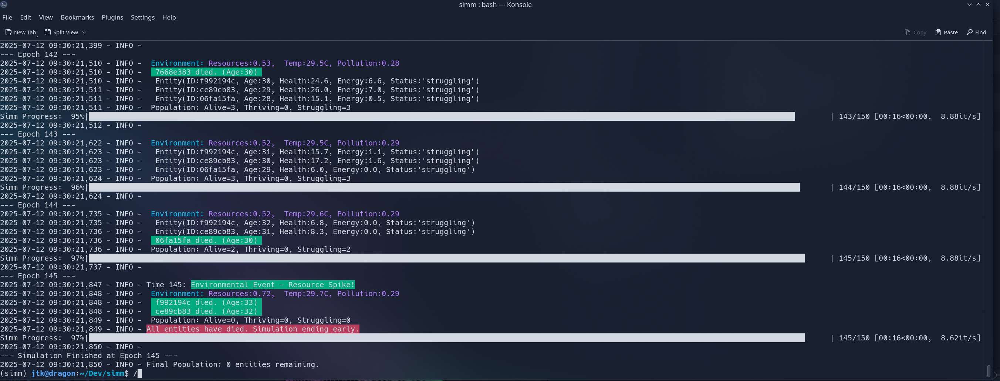

# Terminal Lifeform

🧬 **Terminal Lifeform** — a terminal-native digital ecosystem where tiny lifeforms evolve, struggle, and die in a sandbox of entropy.

 

**Ents live and they die.**  
**Sometimes they even can thrive.**  
**Usually, they die.**



---

## 🧬 Features

- 🔁 Terminal UI (with color, progress bars, status indicators)
- 🧬 Object-oriented and modular design
- 🌡 Entities, parameters, and behavior all easily customizable
- 🌈 Built using [uv](https://github.com/astral-sh/uv) and `pyproject.toml`
- ⚙️ fast, modern Python tooling
- 📈 Exponential decay with age ( non-linear )

---

## 🚀 Getting Started

### 🧰 Requirements

- Python 3.10+
- [`uv`](https://github.com/astral-sh/uv) (blazing-fast Python package manager)

### Install & Run

```bash
# Clone the repo
git clone https://github.com/jtkIII/TerminalLifeform.git
cd TerminalLifeform

# Setup environment with uv
uv venv
source .venv/bin/activate

# Install dependencies
uv pip install -r requirements.txt

# Or, if you're using pyproject.toml directly:
uv sync

# Then run
uv run src/main.py
````

### 📎 Latest List

- ✅ docs/NEXTSTEPS.md
- ✅ added build-system / setuptools
- ✅ added interactive choose world menu

## 🛠 Roadmap Ideas

- [x] Entity evolution
- [ ] Save/load state
- [ ] Visualization or external UI (web? curses? pygame?)
- [x] Entity logging or journaling
- [x] Terminal-only chaos engine

### 🔍 Details of Exponential decay with age

#### Behavior of `health_change -= 0.01 * (entity.age ** 1.2)`

| Age | `age * 0.01` (linear) | `0.01 * age^1.2` (nonlinear) |
| --- | --------------------- | ---------------------------- |
| 10  | 0.10                  | 0.16                         |
| 25  | 0.25                  | 0.39                         |
| 50  | 0.50                  | 0.69                         |
| 75  | 0.75                  | 0.95                         |
| 100 | 1.00                  | 1.19                         |

---

### 📈 Why

1. **Early life penalty is still low** → most new entities survive.
2. **Middle age hits faster** → starts to “cull” slower entities earlier.
3. **Old age kills faster** → leading to a **dip** in long-lived individuals.
4. **Population naturally cycles** → fewer elders = fewer potential reproducers = population waves.
5. **Reproduction pressure shifts younger** → system evolves to favor faster reproducers.

- Adds **emergent dynamics** — population pulses, generational cycles.
- Prevents “hoarding” of old, invincible entities.
- **natural lifespans**, with variability from health, energy, and resilience.

---

```python

# **More gentle aging:**
health_change -= 0.005 * (entity.age ** 1.1)

# **Harsh elder culling:**
health_change -= 0.02 * (entity.age ** 1.5)

# **Exponential death zone:**
if entity.age > 50:
    health_change -= 0.05 * (entity.age - 50) ** 2

```

#### Current Version

**this version is stable up to the 727 epoch with these results:**

- 🌱 Alive=20
- 🔥 Thriving=4
- ☠️ Struggling=7

So ideally it needs to be a little less deadly, but be careful. Small tweaks can create big changes.

---

#### 📄 License

MIT – open-ended digital life is for everyone.

---

#### 🤝 Contributing

Contributions are welcome — especially new behaviors, parameters, or visualization modes. Open an issue or PR and let's evolve some chaos together. You can [see where my thinking is](docs/NEXTSTEPS.md) concering next steps.
